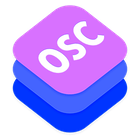
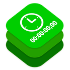
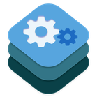
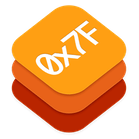
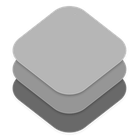

## About Me

My name is Steffan Andrews and I hail from beautiful Vancouver, Canada.

I'm a professional [composer for film and TV](http://www.imdb.com/name/nm2862027) with over 19 years of experience specializing in animated series.

I've also been a life-long coder since 1995. I have helped build numerous commercial Mac applications including [Audio Design Desk](https://add.app) and [Dipper](https://dipper.audio). In my spare time I create and maintain open-source packages for Swift (cross-platform) and SwiftUI.

## Featured Swift Packages

<table><tbody>
  <tr valign="top">
    <td width=120>
      
    </td>
    <td>
      <h3><a href="https://github.com/orchetect/swift-midi">SwiftMIDI</a></h3>
      Modular multi-platform MIDI toolkit with MIDI 2.0 support.
    </td>
  </tr>
  <tr valign="top">
    <td>
      
    </td>
    <td>
      <h3><a href="https://github.com/orchetect/swift-osc">SwiftOSC</a></h3>
      Open Sound Control (OSC) library written in Swift.
    </td>
  </tr>
  <tr valign="top">
    <td>
      
    </td>
    <td>
      <h3><a href="https://github.com/orchetect/swift-timecode">SwiftTimecode</a></h3>
      A robust and precise Swift library for working with SMPTE timecode.
    </td>
  </tr>
  <tr valign="top">
    <td>
      
    </td>
    <td>
      <h3><a href="https://github.com/orchetect/swift-prefs">SwiftPrefs</a></h3>
      Modern, flexible, observable, testable app preferences written in Swift.
    </td>
  </tr>
  <tr valign="top">
    <td>
      
    </td>
    <td>
      <h3><a href="https://github.com/orchetect/swift-radix">SwiftRadix</a></h3>
      Translate integers to/from radix strings (binary, hex, etc.) using convenient syntax.
    </td>
  </tr>
</tbody></table>

## Featured SwiftUI Packages

<table><tbody>
  <tr valign="top">
    <td width=120>
      
    </td>
    <td>
      <h3><a href="https://github.com/orchetect/MacControlCenterUI">MacControlCenterUI</a></h3>
      SwiftUI menu builder DSL & controls that mimic macOS Control Center.
    </td>
  </tr>
  </tr>
  <tr valign="top">
    <td width=120>
      
    </td>
    <td>
      <h3><a href="https://github.com/orchetect/MenuBarExtraAccess">MenuBarExtraAccess</a></h3>
      Show/hide SwiftUI MenuBarExtra menu using Bindings.
    </td>
  </tr>
  </tr>
  </tr>
  <tr valign="top">
    <td width=120>
      
    </td>
    <td>
      <h3><a href="https://github.com/orchetect/SettingsAccess">SettingsAccess</a></h3>
      Open your macOS app's Settings scene programmatically without needing SettingsLink.
    </td>
  </tr>
  </tr>
</tbody></table>
