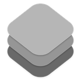

## About Me

My name is Steffan and I hail from beautiful Vancouver, Canada. On cloudy, rainy days I can be found sitting indoors coding. And on gloriously sunny days I can also be found indoors coding.

I've been a professional composer for film and TV for over 15 years. In my spare time I build and maintain open-source packages for Swift and SwiftUI that I think people will find useful, with an emphasis on precision, correctness and reliability.

## Featured Swift Packages

<table><tbody>
  <tr valign="top">
    <td width=120>
      
    </td>
    <td>
      <h3><a href="https://github.com/orchetect/MIDIKit">MIDIKit</a></h3>
      Modern multi-platform Swift CoreMIDI wrapper with MIDI 2.0 support.
    </td>
  </tr>
  <tr valign="top">
    <td>
      
    </td>
    <td>
      <h3><a href="https://github.com/orchetect/OSCKit">OSCKit</a></h3>
      Open Sound Control (OSC) library written in Swift.
    </td>
  </tr>
  <tr valign="top">
    <td>
      
    </td>
    <td>
      <h3><a href="https://github.com/orchetect/TimecodeKit">TimecodeKit</a></h3>
      A robust and precise Swift library for working with SMPTE timecode.
    </td>
  </tr>
  <tr valign="top">
    <td>
      
    </td>
    <td>
      <h3><a href="https://github.com/orchetect/SwiftRadix">SwiftRadix</a></h3>
      Translate integers to/from radix strings (binary, hex, etc.) using convenient syntax.
    </td>
  </tr>
</tbody></table>

## Featured SwiftUI Packages

<table><tbody>
  <tr valign="top">
    <td width=120>
      
    </td>
    <td>
      <h3><a href="https://github.com/orchetect/MacControlCenterUI">MacControlCenterUI</a></h3>
      SwiftUI menu builder DSL & controls that mimic macOS Control Center.
    </td>
  </tr>
  </tr>
  <tr valign="top">
    <td width=120>
      
    </td>
    <td>
      <h3><a href="https://github.com/orchetect/MenuBarExtraAccess">MenuBarExtraAccess</a></h3>
      Show/hide SwiftUI MenuBarExtra menu using Bindings.
    </td>
  </tr>
  </tr>
</tbody></table>